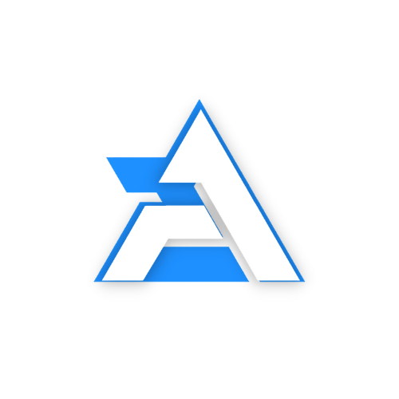

<div align="center">



<br/>

# Hey there, I'm Ahmed Ali 

###  Full-Stack .NET Developer · Freelancer

[](https://A7md.design)
[](https://twitter.com/officiala7md3li)
[](https://linked.in/a7md3li)

<br/>


</div>

---

##  About

```json
{
    "name": "Ahmed Ali",
    "location": "Egypt, Mansoura",
    "role": "Software Engineer & Freelancer",
    "languages": {
        "humans": [
            "English",
            "Arabic"
        ],
        "machines": [
            "C#",
            "VB.NET",
            "SQL",
            "JavaScript",
            "HTML/CSS"
        ]
    },
    "keywords": [
        "ERP Systems",
        "API Integrations",
        "e-Invoicing",
        "AI / NL-to-SQL",
        "Clean Architecture",
        "Leadership"
    ]
}
```

---

##  Currently

| | |
|---|---|
|  **Building** | `SQL-AI-Generator` — Fine-tuned LLM that turns natural-language → T-SQL on a 403-table ERP schema |
|  **Maintaining** | `WASystem` — WhatsApp Business API platform (Clean Architecture, SignalR, Hangfire) |
|  **Working on** | ERP systems & e-invoicing solutions for clients in Egypt & Saudi Arabia |
|  **Tracking** | ZATCA (KSA), PINT AE, and Egyptian e-invoicing standards |
|  **Side project** | `Bedwaha Pulse (نبض البدوها)` — Volunteer blood-donor registry, Arabic-first UI |

---

##  Tech Stack

<div align="center">

#### Languages


#### Frameworks & Libraries


#### Tools & Platforms


</div>

---

##  Selected Projects

| Project | What it does | Stack |
|---|---|---|
| **SQL-AI-Generator** | Fine-tuned LLM (Qwen, via Unsloth) that turns natural-language questions into T-SQL against a 403-table ERP schema | LLM Fine-tuning, LoRA/QLoRA, Google Colab |
| **WASystem** | WhatsApp Business API integration platform — Meta compliance, templates, real-time messaging | ASP.NET Core, Clean Architecture, SignalR, Hangfire, EF Core |
| **Bedwaha Pulse** | Volunteer blood-donor registry for my hometown — fully Arabic UI, because saving a life shouldn't require thinking in English | .NET 9, Clean Architecture |


---

<div align="center">

###  Let's Connect!

<br/>

[](https://A7md.design)
[](https://twitter.com/officiala7md3li)
[](https://linked.in/a7md3li)

<br/>


<br/>

<sub>Solid engineering, in service of something someone actually needs.</sub>

<br/><br/>


</div>
